# CTFd with plugins

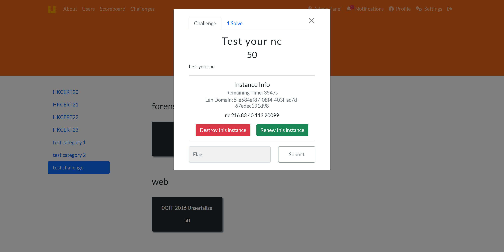

[toc]

## Introduction

This handbook contains the implement of original CTFd platform and some useful plugins.
You can use my repository to start and skip steps 1-5 (building CTFd).
But it is more recommended to use the original branch and rebuild yourself, in order to better understand the role for each component and make full use of it.
Some configuration need to fillin tokens, please change it to yours.

## Environment & Requirements
The environment I used when building:
CentOS 7 (capable and recommend with ubuntu 22.04 LTS)
CTFd v3.6.1 on Feb 2024 (the latest one is v3.7.0)
keycloak 24.0.4
docker 26.1.2
docker compose v2.27.0

for the details please check `requirements.txt`

## 1. Download CTFd

`git clone  https://github.com/CTFd/CTFd.git`
or download on [release](https://github.com/CTFd/CTFd/releases)
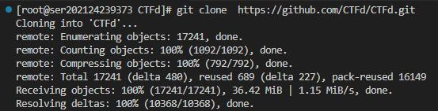

## 2. Modify `DockerFile`

Can be skipped.
Mainly modify the update sources of apt and pip to ustc and aliyun mirror.
If the server is located in mainland China, you can modify it for faster building.

```
FROM python:3.11-slim-bookworm as build

WORKDIR /opt/CTFd

# hadolint ignore=DL3008
# RUN echo `ls -alh /etc/apt/sources.list.d`
RUN sed -i "s@http://deb.debian.org@http://mirrors.aliyun.com@g" /etc/apt/sources.list.d/debian.sources
RUN apt-get update \
    && apt-get install -y --no-install-recommends \
        build-essential \
        libffi-dev \
        libssl-dev \
        git \
    && apt-get clean \
    && rm -rf /var/lib/apt/lists/* \
    && python -m venv /opt/venv

ENV PATH="/opt/venv/bin:$PATH"

COPY . /opt/CTFd

RUN pip install --no-cache-dir -r requirements.txt -i https://mirrors.ustc.edu.cn/pypi/web/simple \
    && for d in CTFd/plugins/*; do \
        if [ -f "$d/requirements.txt" ]; then \
            pip install --no-cache-dir -r "$d/requirements.txt"  -i https://mirrors.ustc.edu.cn/pypi/web/simple ;\
        fi; \
    done;


FROM python:3.11-slim-bookworm as release
WORKDIR /opt/CTFd

# hadolint ignore=DL3008
RUN sed -i "s@http://deb.debian.org@http://mirrors.aliyun.com@g" /etc/apt/sources.list.d/debian.sources
RUN apt-get update \
    && apt-get install -y --no-install-recommends \
        libffi8 \
        libssl3 \
    && apt-get clean \
    && rm -rf /var/lib/apt/lists/*

COPY --chown=1001:1001 . /opt/CTFd

RUN useradd \
    --no-log-init \
    --shell /bin/bash \
    -u 1001 \
    ctfd \
    && mkdir -p /var/log/CTFd /var/uploads \
    && chown -R 1001:1001 /var/log/CTFd /var/uploads /opt/CTFd \
    && chmod +x /opt/CTFd/docker-entrypoint.sh

COPY --chown=1001:1001 --from=build /opt/venv /opt/venv
ENV PATH="/opt/venv/bin:$PATH"

USER 1001
EXPOSE 8000
ENTRYPOINT ["/opt/CTFd/docker-entrypoint.sh"]
```

## 3. Modify `docker-compose.yml`

setting frpc and frps for the container.
you can also choose to use `/conf/frpc.ini` and `/conf/frps.ini` files.
add networks for communication.
you can still use internal network for containers if reverse shell is not allowed.
see comment for details

```
version: '3.7'
# we need docker swarm
# the version should be greater than 3 using python docker
# will be ignored by GOlang docker

services:
  ctfd:
    build: .
    user: root
    restart: always
    ports:
      - "8000:8000"
    environment:
      - UPLOAD_FOLDER=/var/uploads
      - DATABASE_URL=mysql+pymysql://ctfd:ctfd@db/ctfd
      - REDIS_URL=redis://cache:6379
      - WORKERS=1
      - LOG_FOLDER=/var/log/CTFd
      - ACCESS_LOG=-
      - ERROR_LOG=-
      - REVERSE_PROXY=true
    volumes:
      - .data/CTFd/logs:/var/log/CTFd
      - .data/CTFd/uploads:/var/uploads
      - .:/opt/CTFd:ro
      - /var/run/docker.sock:/var/run/docker.sock
    depends_on:
      - db
      # run after frpc
      - frpc
    networks:
        default:
        frp_connect:
          ipv4_address: 172.1.0.4


  db:
    image: mariadb:10.11
    restart: always
    environment:
      - MYSQL_ROOT_PASSWORD=ctfd
      - MYSQL_USER=ctfd
      - MYSQL_PASSWORD=ctfd
      - MYSQL_DATABASE=ctfd
      - MARIADB_AUTO_UPGRADE=1
    volumes:
      - .data/mysql:/var/lib/mysql
    networks:
        # frps need to be exposed to public network
        default:
    # This command is required to set important mariadb defaults
    command: [mysqld, --character-set-server=utf8mb4, --collation-server=utf8mb4_unicode_ci, --wait_timeout=28800, --log-warnings=0]

  cache:
    image: redis:4
    restart: always
    volumes:
    - .data/redis:/data
    networks:
        default:

  frps:
    image: frankli0324/frp:frps
    restart: always
    # subdomain_host and port is used for http type challenge
    # example `http://prefix.challenge.liuyx.icu:8080/`
    # for direct type challenge, it will use ip address
    # example `nc 10.0.0.23 20056`
    command: [
      "--bind_addr=172.1.0.6",
      "--bind_port=7897",
      "--token=your_token",
      "--subdomain_host=challenge.liuyx.icu",
      "--vhost_http_port=8080",
    ]
    environment:
      - SET_CONTAINER_TIMEZONE=true
      - CONTAINER_TIMEZONE=Asia/Shanghai
      - TZ='Asia/Shanghai'
    ports:
      # ports for direct type (pwn)
      # if the performance is insufficient, change the number to a smaller value
      - 20000-20100:20000-20100
      # ports for http type
      - 8080:8080
    networks:
      frp_connect:
        ipv4_address: 172.1.0.6
      # expose frps to public network for accessing challenges
      default:

  frpc:
    image: frankli0324/frp:frpc
    restart: always
    command: [
      "--server_addr=172.1.0.6",
      "--server_port=7897",
      "--token=your_token",
      "--admin_addr=172.1.0.5",
      "--admin_port=7000",
    ]
    environment:
      - SET_CONTAINER_TIMEZONE=true
      - CONTAINER_TIMEZONE=ASIA/Shanghai
    depends_on:
      # require frps start first
      - frps
    networks:
      frp_connect:
        ipv4_address: 172.1.0.5
      frp_containers:
      # internal:
      # Comment out internal can allow challenges use reverse shell
      # but may face security issues


networks:
  default:
  internal:
    internal: true
  frp_connect:
    driver: overlay
    internal: true
    attachable: true
    ipam:
      config:
        - subnet: 172.1.0.0/16
  frp_containers:
    driver: overlay
    internal: false  # allow to access network for reverse shell
    attachable: true
    ipam:
      config:
        - subnet: 172.2.0.0/16

```

## 4. Configure page theme

* download and unzip to `/CTFd/CTFd/themes/[theme name]`
(theme is modified from build-in `core-beta`)

* then add an API to support categories and tags

`/CTFd/CTFd/api/v1/challenges.py`
```
@challenges_namespace.route("/categories")
class ChallengeCategories(Resource):
    @challenges_namespace.doc(description="Endpoint to get Challenge categories in bulk")
    #@cache.memoize(timeout=60)
    def get(self):
        chal_q = (Challenges.query.with_entities(Challenges.category).group_by(Challenges.category))
        if not is_admin() or request.args.get("view") != "admin":
            chal_q = chal_q.filter(and_(Challenges.state != "hidden", Challenges.state != "locked"))
        return {"success": True, "data": [i.category for i in chal_q]}
```        

## 5. Configure ctf-whale plugin

the original repository is forked from `https://github.com/frankli0324/ctfd-whale`
due to being in disrepair, the original repository will have bugs in new version of CTFd, which needs to be fixed.

* download and unzip fixed version to `/CTFd/CTFd/plugins/[plugin name]`
* configuration conf file. Create if not exist
Please set the settings consistent with `docker-compose.yml`

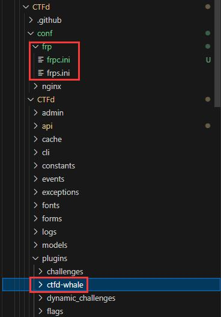

* frpc.ini
```
[common]
token = your_token
server_addr = 172.1.0.6
server_port = 7897  # corresponding to the bind_port of frps
admin_addr = 172.1.0.5
admin_port = 7000
```
* frps.ini
```
[common]
# dont conflict with direct type challenges' ports
bind_port = 7987  # frpc to frps port
vhost_http_port = 8080  # frps for http type challenges
token = your_token
subdomain_host = challenge.liuyx.icu  # domain for http type
```

## 6. Configure ctf-sso plugin (unfinished)

the original repository is forked from `https://github.com/r00tstici/CTFd-SSO-plugin`
due to being in disrepair, the original repository will have bugs in new version of CTFd, which needs to be fixed.

* download and unzip fixed version to `/CTFd/CTFd/plugins/[plugin name]`
* add values in `[extra]` section of `/CTFd/CTFd/config.ini`
  * `OAUTH_CREATE_BUTTONS`: set `True` if you want to allow registration via OAuth even if normal registration is turned off. Default is `False`.
  * `OAUTH_ALWAYS_POSSIBLE`: set `True` if you want to automatically add the OAuth login buttons in the login page. Default is `False`.

## 7. Configure environment

Configure the environment first and then start it, then add other functions later

### 7.1 change yum mirror to aliyun (if needed)

`wget -O /etc/yum.repos.d/CentOS-Base.repo https://mirrors.aliyun.com/repo/Centos-7.repo`

`yum makecache`

incase wget is not installed
`yum install wget`

### 7.2 install docker-ce and compose (if needed)
* check version:
`docker version`
`docker compose version`
* clean old docker
`sudo yum remove docker docker-client docker-client-latest docker-common docker-latest docker-latest-logrotate docker-logrotate docker-engine`
* install docker-ce
`sudo yum install -y yum-utils`
`sudo yum-config-manager --add-repo https://download.docker.com/linux/centos/docker-ce.repo`
`sudo yum install docker-ce docker-ce-cli containerd.io docker-buildx-plugin docker-compose-plugin`
* start docker
`sudo systemctl start docker`
`sudo docker run hello-world`

* incase need mainland mirror
`/etc/docker/deamon.json`
```
{
  "registry-mirrors": [
    "https://docker.mirrors.ustc.edu.cn"
  ]
}
```

### 7.3 initialize the cluster of docker swarm

`sudo docker swarm init --force-new-cluster`
`sudo docker node update --label-add='name=linux-1' $(sudo docker node ls -q)`

## 8. Start

### 8.1 try to start

recommended to execute this before starting
`sudo chmod +x -R .`

first build may take a long time
`docker build .`

first start without `-d` option to check the logs
`docker compose up`

another terminal check docker status is up or not (up or exit)
`docker ps`

if something goes wrong, you can use `docker compose stop` and `docker compose up` restart
ff a serious error occurs, it is recommend to remove the related containers and boot from clean again
do **not** do so when there are other containers
`docker stop $(docker ps -aq)`
`docker rm $(docker ps -aq)`
`docker compose up -d`

### 8.2 configuration

the default address is `http://[localhost]:8080/` change it if you using another host or setting network address translation

once failed, check if network is running, or disable proxy
`netstat -ntlp | grep 8000`

* general settings as you want
remember to use modified theme `pages` on style
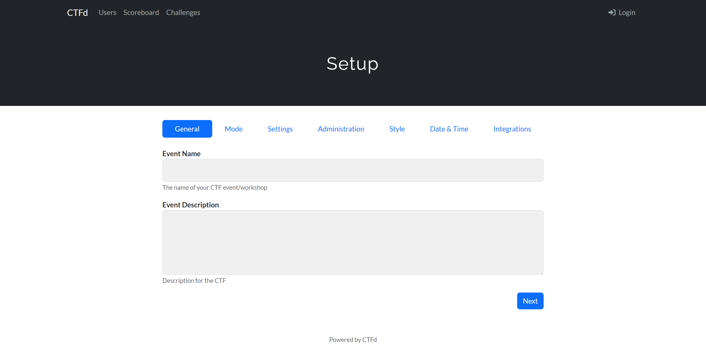
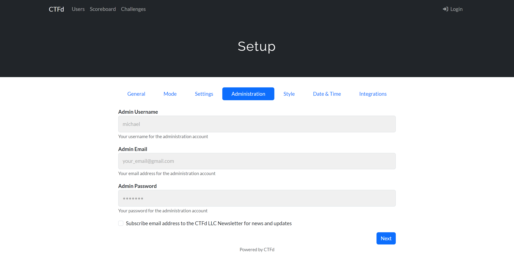
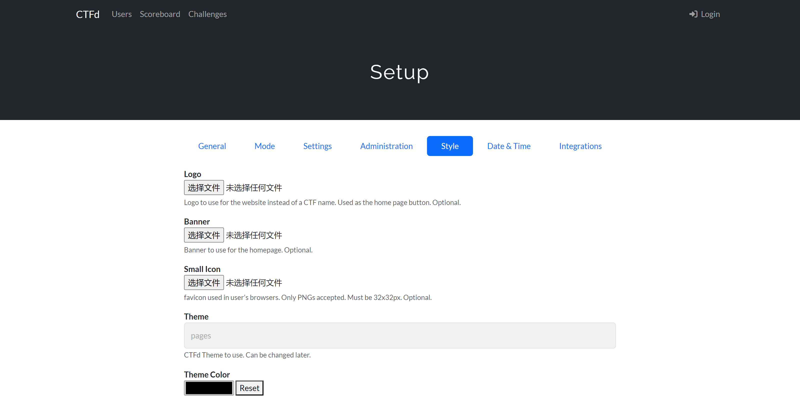

* setting for ctf-whale
after entering the platform, we should setup the whale
  1. go to `admin panel - whale`
  2. configure `docker`
   copy the network name and paste into `Auto Connect Network` Section
   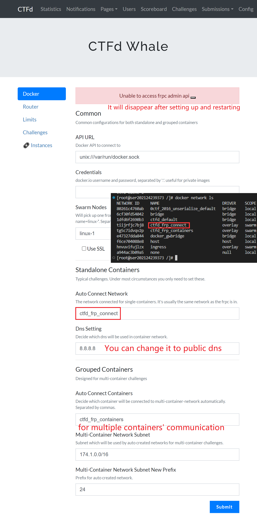
  3. configure `router`
   copy the settings of frp
   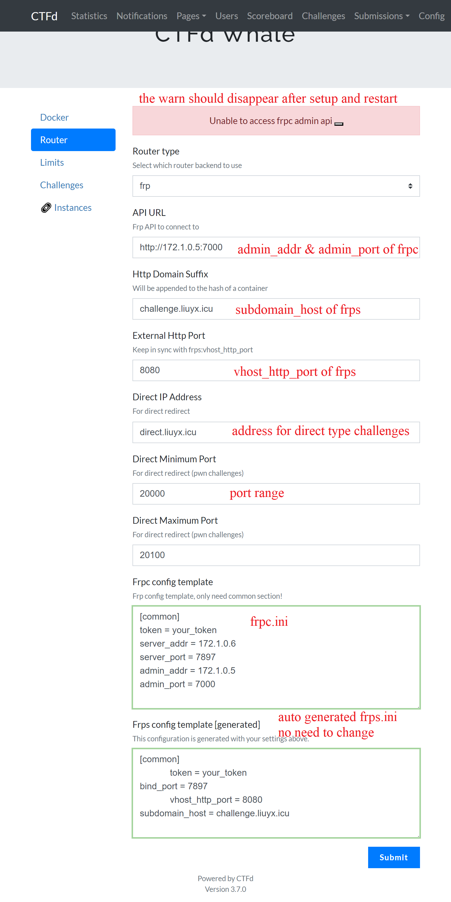
  4. restart the frps and frpc, the warning should disapper
   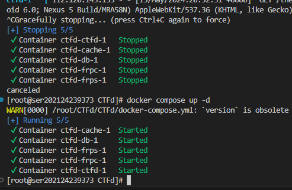
  5. dynamic flag format
   the format of generated flag, the flags will pass to challenge container as environment variable
   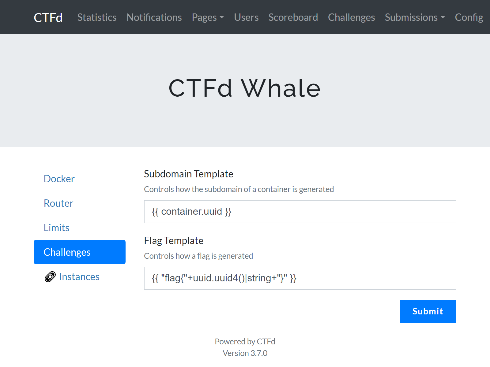

## 9. Dynamic container and challenges

### 9.1 write a challenge
if you want to use dyanmic, the flags will pass to challenge container as environment variable `$FLAG`

you can follow these example commands of `DockerFile` to write
the exposed port will be used when importing, recommend to use same one
```
CMD ["/bin/sh" "-c" "exec /bin/bash -c \"chown root:ctf /pwn/pwn && chmod 750 /pwn/pwn && echo $FLAG > /flag && export FLAG=not_flag && FLAG=not_flag && /etc/init.d/xinetd start; trap : TERM INT; sleep infinity & wait\""]
EXPOSE 10000
```
```
CMD exec /bin/bash -c 'echo $FLAG > /home/ctf/flag;FLAG=0;/etc/init.d/xinetd start; trap : TERM INT; sleep infinity & wait'
EXPOSE 9999
```
example challenges for test
test your nc: `docker pull glzjin/test_your_nc`
pwn1: including in attachment
ctf training: `https://github.com/CTFTraining/CTFTraining`
there are many other competitions' challenges that are open source like hkcert
but not all questions support dynamic flags, may need to modify `DockerFile`

### 9.2 build a challenge image
run `docker compose build` in the image directory should works
if you write your own, please use a unique tag

### 9.3 add a challenge
1. go to `admin panel - challenge`, click the `+` icon above to add a new challenge
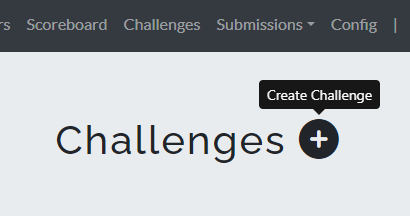
2. challenge settings
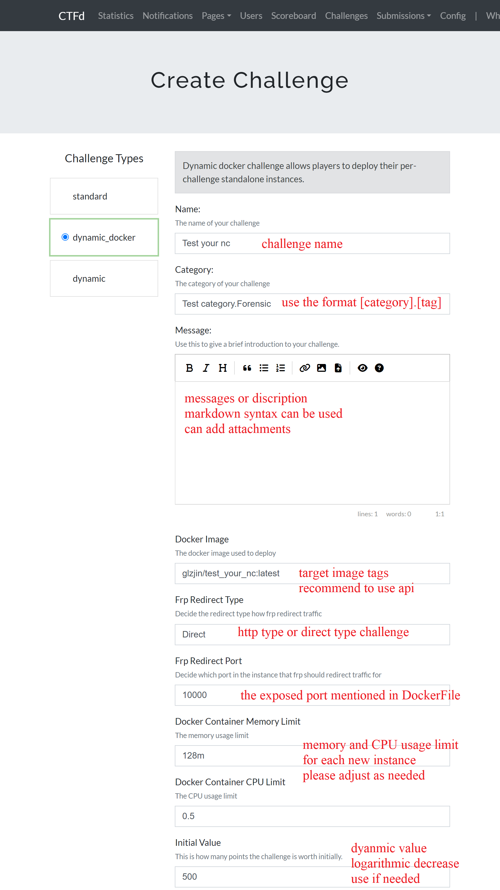
3. flag settings
if you use dynamic flag, leave it blank
change the state to visible so that can be found on challenges page
otherwise it can only display on admin panel
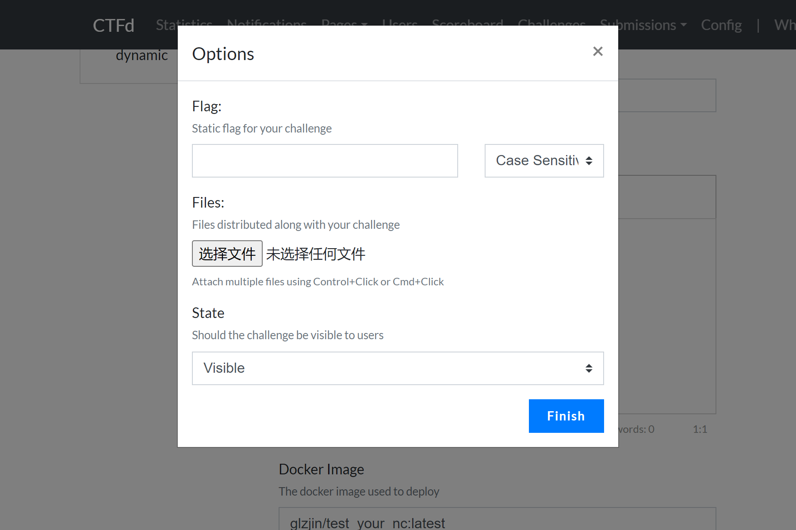
4. we can now see the challenge in admin panel
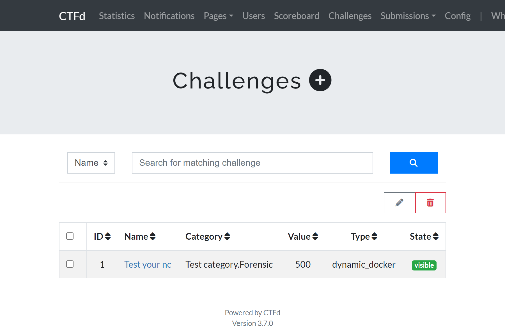


## 10 Test the platform
1. we can find the challenge in challenges page, categorized using categories and tags
   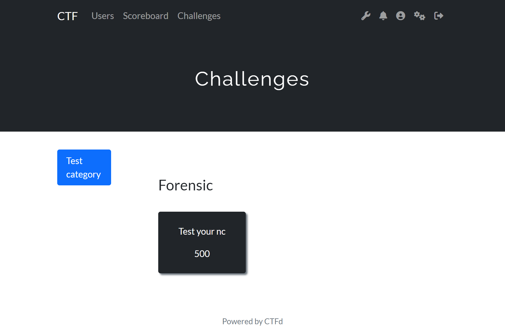
2. we can see its details
   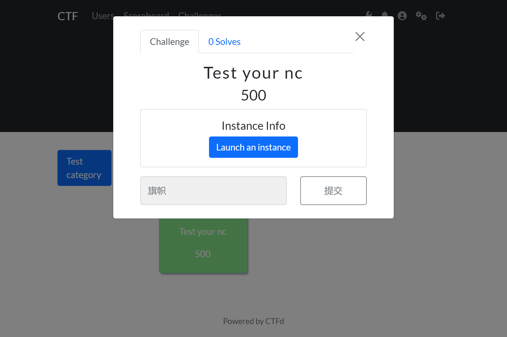
3. apply a new instance of it
   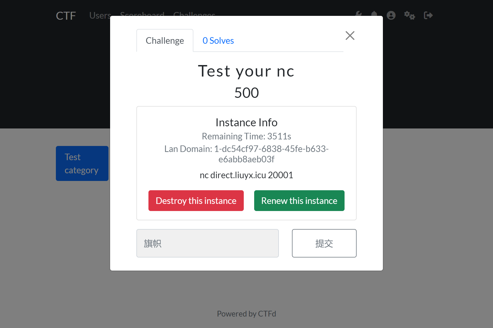
4. test if the nc command usable
   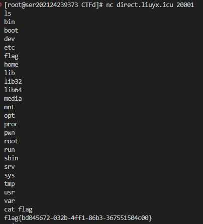
5. dynamic flag works fine
   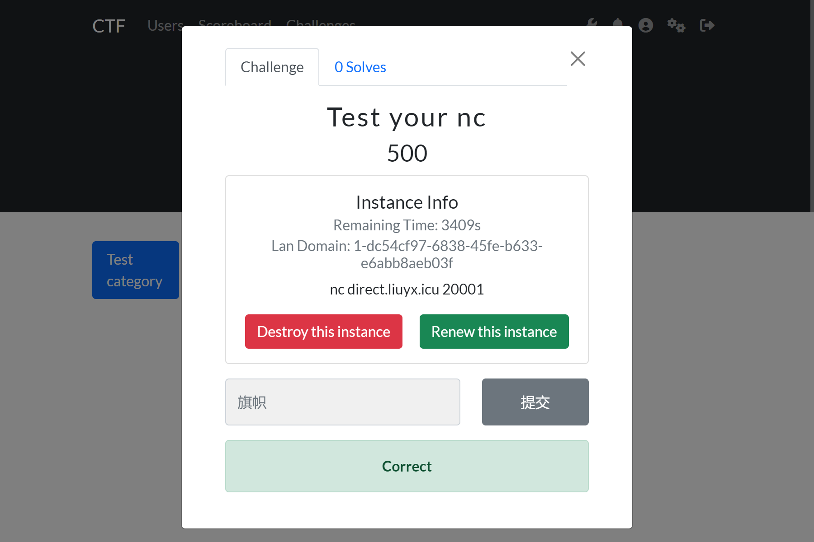
6. we can also check the running instances in admin panel, and its port and flag
   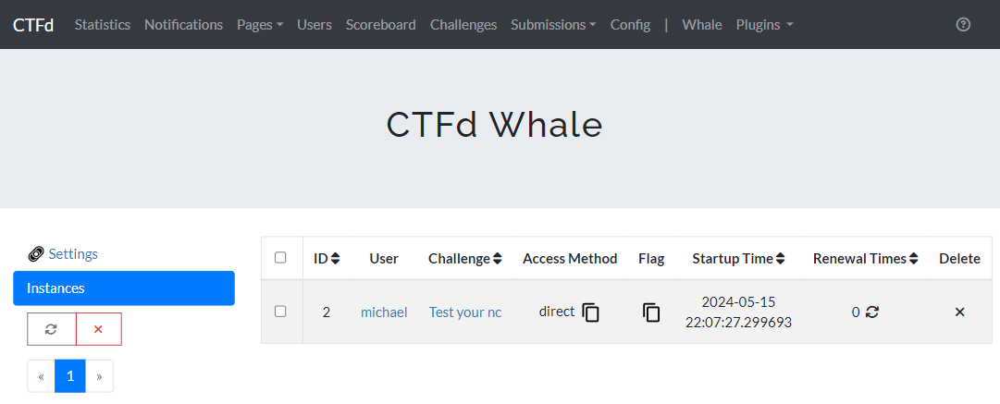
7. if we add the function of notification, we can also get solving broadcast
   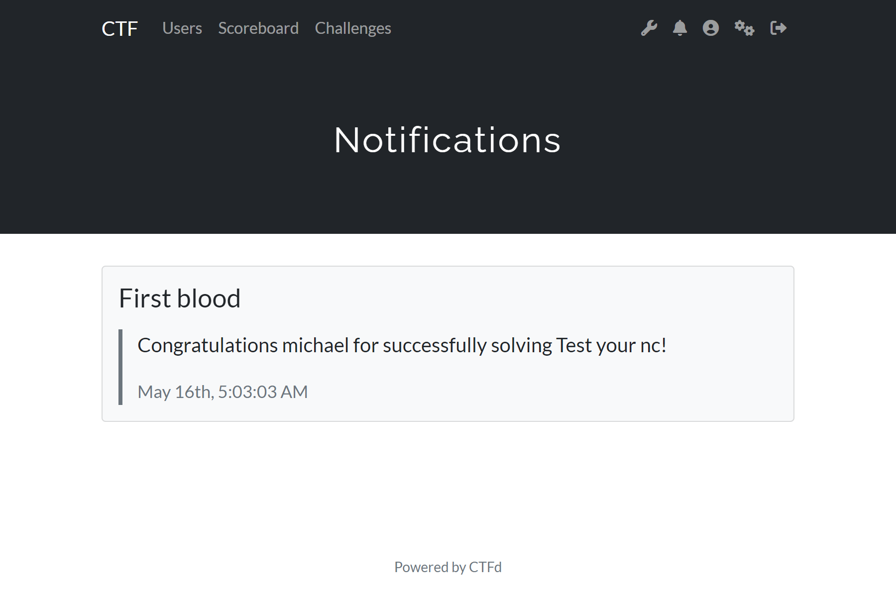


## Appendix

Recommended functions or plugins

* API for docker images display and select:
`/CTFd/CTFd/api/v1/challenges.py`
```
import docker

@challenges_namespace.route("/docker_images")
class GetDockerImages(Resource):
    @challenges_namespace.doc(description="No Docker Images")
    def get(self):
        if is_admin():
            client = docker.from_env()
            images = client.images.list()
            return {"success": True, "data": [image.tags[0] for image in images if image.tags] }
        return {"success": False}
```

* broadcast for solving a challenge
`/CTFd/CTFd/api/v1/challenges.py`
find the successful attempt location (you can search`The challenge plugin says the input is right`), add following codes before `return`
```
from CTFd.schemas.notifications import NotificationSchema # header
from flask import current_app    # header

#######################################################################
challenge   = Challenges.query.filter_by(id=challenge_id).first_or_404()
usern       = user.name
challenge_name = challenge.name
req = {
    "title":"Congrats",
    "content":f"Congratulations {usern} for successfully solving {challenge_name}!",
    "type":"toast",
    "sound":1
    }
schema = NotificationSchema()
result = schema.load(req)

db.session.add(result.data)
db.session.commit()

response = schema.dump(result.data)

# Grab additional settings$
notif_type = req.get("type", "alert")
notif_sound = req.get("sound", True)
response.data["type"] = notif_type
response.data["sound"] = notif_sound
current_app.events_manager.publish(data=response.data, type="notification")
#######################################################################
```

* ctfd recaptcha plugin
may be outdate, need to check for compatibility
reference: `https://github.com/tamuctf/ctfd-recaptcha-plugin`

* nginx reverse proxy
configure for domain proxy, need a pan-domain name resolution for http type challenges
```
#######################################################################
    server {
        listen       80;
        server_name  _; # match all hostname (subdomains) 
    }

    server {
        listen       80;
        server_name  ctf.liuyx.icu;
        location / {
            proxy_pass http://localhost:8000/;
            proxy_set_header Host $proxy_host; # 修改转发请求头
            proxy_set_header X-Real-IP $remote_addr;
            proxy_set_header X-Forwarded-For $proxy_add_x_forwarded_for;
        }
    }

        server {
        listen       80;
        server_name  sso.liuyx.icu;
        location / {
            proxy_pass http://localhost:8180/;
            proxy_set_header Host $proxy_host; # 修改转发请求头
            proxy_set_header X-Real-IP $remote_addr;
            proxy_set_header X-Forwarded-For $proxy_add_x_forwarded_for;
        }
    }

        server {
        listen       80;
        server_name  *.challenge.liuyx.icu;
        location / {
            proxy_pass http://localhost:8080/;
            proxy_set_header Host $proxy_host; # 修改转发请求头
            proxy_set_header X-Real-IP $remote_addr;
            proxy_set_header X-Forwarded-For $proxy_add_x_forwarded_for;
        }
    }
#######################################################################
```

## Reference

CTFd: https://github.com/CTFd/CTFd
CTFd-whale: https://github.com/frankli0324/ctfd-whale
CTFd-SSO-Plugin: https://github.com/r00tstici/CTFd-SSO-plugin
keycloak: https://www.keycloak.org/